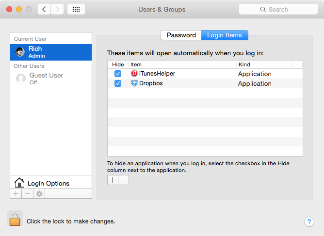
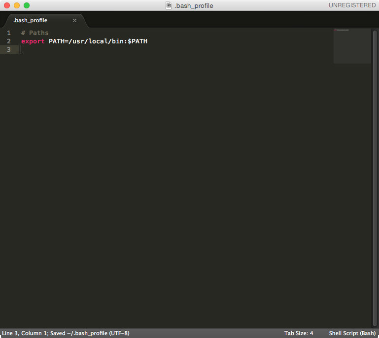

Bash profile
============

You probably noticed that when you turn on your computer that certain applications start up along with it. Some of those applications are required by the operating system, and some of those applications are ones you installed yourself. And maybe some of those applications make your computer's fan sound like an airplane taking off.

You can see some of these applications in the "Login Items" tab of the "Users & Groups" section of your System Preferences.

But some applications have their own login items, which are run only when that specific application is opened. We're going to use Terminal's login items feature to make web development easier.

What is Bash profile?
---------------------

The **Bash profile** is a file on your computer that Terminal runs every time a new Terminal session is created. This is important because we need to run certain code every time before getting any real work done.

OS X doesn't include a Bash profile by default, but if you have one, it lives in your OS X home directory with the name ``.bash_profile``. Even if you had one, you likely never saw it before because its name starts with a period, and the Finder hides from view all folders and files whose name starts with a period to protect the casual user from harming the operating system. But because you're a developer now, we're going to create a new Bash profile or edit your existing one!

Creating or editing your Bash profile
-------------------------------------

Open Terminal, copy and paste the following command (remembering not to include the ``$`` and adjacent space character), and hit ``Return``:

.. code-block:: bash

   $ subl ~/.bash_profile

The tilda (``~``) tells Terminal to start traversing the file system from one's home directory. In my personal case, an equivalent command would have been ``subl /Users/Rich/.bash_profile``, which means ``~`` is the equivalent of ``/Users/Rich``. Using ``~`` is a shortcut that also makes it generic and usable for everybody to copy and paste.

A Sublime Text window will appear, which might contain existing code.

Understanding your PATH
-----------------------

The first edit to your Bash profile is to correct your `PATH <http://en.wikipedia.org/wiki/PATH_%28variable%29>`_. PATH is an **environment variable**, which means that PATH represents some small bit of data while you use Terminal; specifically PATH contains a list of file system paths where the operating system can find programs to run.

When a developer runs a program from Terminal, the computer will sequentially look for the program in each of the paths that PATH contains, starting with the first path listed. If the computer can't find the program in the first path, it looks for the same program in the second path, and so on, either eventually finding and running the program or returning an error if the program couldn't be found.

PATH is represented in Bash as ``$PATH``, and the paths it contains are delimited by a colon (``:``). Therefore, its value might look something like:

.. code-block:: bash

   /usr/local/bin:/usr/bin:/bin:/usr/sbin:/sbin

You can see that ``/usr/local/bin`` is the first path, and ``/usr/bin`` is the second path. The first path is where all programs *local* to your use of the operating system are located. Storing programs for your personal use in ``/usr/local/bin`` is a best practice and highly encouraged. Therefore, this path is correct.

Likewise storing programs in ``/usr/bin`` means that programs are globally accessible by other users. Although storing programs globally can sometimes be desirable, in general it's discouraged and likely to cause confusion.

Correcting your PATH
--------------------

In versions of OS X prior to Yosemite, Apple mistakenly switched the order of the paths, placing ``/usr/bin`` ahead of ``/usr/local/bin``, causing much disruption and angst. Apple has since corrected the issue, but it's still worth correcting because doing so won't harm the operating system and will prevent the issue from reoccuring in the future.

Copy and paste the following into your text editor:

.. code-block:: bash

   # Paths
   export PATH=/usr/local/bin:$PATH

The first line, which begins with a hash (``#``) is a comment and merely exists to help you remember your edits. The right portion of the second line begins ``/usr/local/bin``, which is the path we want to prioritize, followed by ``:$PATH``, which appends the existing PATH. This way we don't overwrite the existing PATH while prioritizing the ``local`` directory, making everything nice and tidy!

Next we assign the value ``/usr/local/bin:$PATH`` to our well known variable ``PATH`` and export it at the same time. Exporting PATH ensures that the variable is loaded into memory and accessible.

Save and close the file.

Reloading Bash
--------------

Although we edited our Bash profile, it is critical to remember that Terminal runs the code in Bash profile only when a *new Terminal session is created*. Therefore, you should quit Terminal and open it again to make sure that PATH is in fact exported. When Terminal is open again, you can check the value of PATH by running the ``echo`` command:

.. code-block:: bash

   $ echo $PATH

The output might look like either of the two:

.. code-block:: bash

   /usr/local/bin:/usr/bin:/bin:/usr/sbin:/sbin

.. code-block:: bash

   /usr/local/bin:/usr/local/bin:/usr/bin:/bin:/usr/sbin:/sbin

Ensure that ``/usr/local/bin`` is listed prior to ``/usr/bin``.

.. note::

   ``~/.bashrc`` is another file that is similar to ``~/.bash_profile``. The difference between the two is that ``~/.bashrc`` is run every time a new Terminal window is created, which all exist in the same Terminal *session*. The difference is subtle, and for all intents and purposes, ``~/.bash_profile`` is sufficient and least likely to cause disruption.

PATH is just one variable we changed in our Bash profile. We will edit Bash profile to run more important code in the future.
