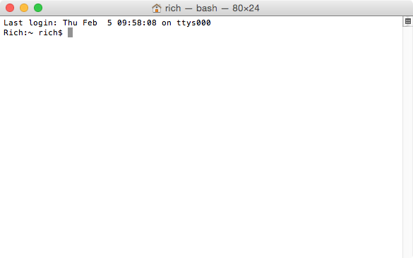
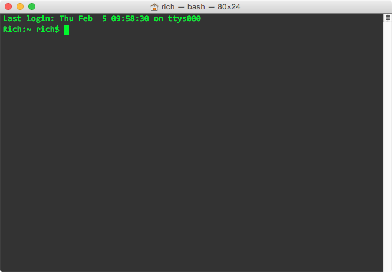

.. _`Command line`:

Command line
************

After a good text editor, the next tool a developer needs to become familiar with is the `command-line interface <https://en.wikipedia.org/wiki/Command-line_interface>`_.

You won't break your computer
=============================

A **command-line interface** is a program that allows developers to interact with a computer by running commands that are typed. The functionality between a command-line interface and the more familiar graphical user interface, known in as the Finder, are similar if not identical.

Beginner developers often have a fear of the command line, thinking they will "break their computer" if they even open the application. Others think it's an old, archaic tool that can't possibly be useful to write modern software. Both ideas can be right, and both ideas can be wrong. As you'll discover, command-line interfaces have advantages and disadvantages just as graphical user interfaces do. Understanding the strengths and weaknesses of one's tools is one of the hallmarks of a good developer.

But, no, you won't break your computer anymore than you would clicking around with a mouse.

You can be bashful now
======================

The command-line interface we'll work with is **Bash**. `Bash <http://www.gnu.org/software/bash/manual/bashref.html#What-is-Bash_003f>`_ is a shell, which is a category of program that loads command-line interfaces, much like Chrome is a web browser. The shell's name comes from its function as a "wrapper" around the kernel, the core program that communicates with the hardware. Bash is the most popular shell today and the default shell inside the `Terminal <https://en.wikipedia.org/wiki/Terminal_(OS_X)>`_ application on OS X. It's worthy to note that shells other than Bash can be loaded inside of Terminal--a feat that web browsers can't and will likely never do.

Open a Finder window, navigate to the ``Applications`` folder, then the ``Utilities`` folder, and open the ``Terminal`` application. It might look something like this, which shows a whole lot of white.

The first line tells me when I last started a Bash session (``Last login: Mon Feb 5 09:58:08``) and on which `Teletypes <https://en.wikipedia.org/wiki/Teleprinter>`_ (``ttys000``), although today the equivalent is simply a tab in Terminal, much like a tab in a web browser. The second line tells me the name of my computer on the network (``Rich``), my current directory (``~``, which is my home directory), the name of my user account (``rich``), and the symbol indicating a prompt for user input (``$``).

Feel free to trick it out in the preferences. I like to make mine look like `The Matrix <http://www.imdb.com/media/rm541630976/tt0133093>`_.

I also recommend dragging the Terminal icon from the Applications folder `into your Dock <http://support.apple.com/kb/PH18815>`_ for easy access in the future.

.. _common_bash_commands:

Common Bash commands
====================

I provide all commands you should run when you need them, but it helps to remember the ones most commonly used.

Each command or symbol is preceded by a comment, which is a line beginning with a hash (``#``) and explains surrounding code. Note that the prompt, represented by the dollar sign (``$``), is meant only to tell you that the line is a Bash command and is not meant to be included as part of the command.

Commands for directory changes (``<directory>`` represents the name of a directory):

.. code-block:: bash

   # Display (print) the path of the current (working) directory
   $ pwd

   # List the contents of a directory
   $ ls <directory>
   
   # Change the current directory
   $ cd <directory>
   
   # Make a directory
   $ mkdir <directory>

   # Open a directory in Finder
   $ open <directory>

   # Create an empty file or, if it exists, update last edit to now
   $ touch <file>

Symbols for directory traversal:

.. code-block:: bash

   # The parent directory
   ../

   # The parent's parent directory
   ../../

   # The root directory
   /

   # The current directory
   .

These commands and others can be combined in interesting ways that would be difficult to replicate in a graphical user interface.

.. code-block:: bash

   # List the items in the parent directory
   $ ls ../

   # Change to the parent's parent directory
   $ cd ../../

   # Make a directory in the root directory
   $ mkdir /<directory>

   # Open the current directory in Finder
   $ open .

.. note::

   You can type the first few letters of a file or directory and then press ``tab`` to cycle through or autocomplete possible items in the current directory.

Additional commands include:

.. code-block:: bash

   # Move or rename
   $ mv <directory or file> <destination>

   # Copy
   $ cp <directory or file> <destination>

   # Delete (remove) a file (or directory with -r flag)
   $ rm <file>

   # Closes the Bash session
   $ exit

If you feel like you need additional guidance, `The Command Line Crash Course <http://cli.learncodethehardway.org/book/>`_ by Zed Shaw is excellent, and `SS64 <http://ss64.com/bash/>`_ lists all Bash commands.

But who are any of us, really?
==============================

Let's run our first command. Copy and paste the following and press ``return``. Take care not to copy and paste the ``$`` and adjacent space.

.. code-block:: bash

   $ whoami

You should've gotten a response with the name of your user account.

.. code-block:: bash

   $ whoami
   Rich

.. note::

   After entering your first command, you can hit the up arrow ``↑`` or down arrow ``↓`` key to cycle through previous commands.

.. _terminal_meet_sublime:

Terminal, meet Sublime
======================

Let's run a powerful command, a helpful trick that will connect Terminal to Sublime Text. Note that you might need to enter your OS X password, and again take care not to copy and paste the ``$`` and adjacent space.

.. code-block:: bash

   $ sudo ln -s "/Applications/Sublime Text 2.app/Contents/SharedSupport/bin/subl" /usr/local/bin/subl

This command will create a `symbolic link <https://en.wikipedia.org/wiki/Symbolic_link>`_, which is the equivalent of an alias or shortcut in the Finder. From now on, when we type ``subl`` and the name of a directory or file in Terminal, that same directory or file will pop up in Sublime Text, ready for us to edit!

Just like text editors, people have varying opinions on shells. `Bash <https://en.wikipedia.org/wiki/Bash_(Unix_shell)>`_ is most popular, but some developers claim `Z shell <http://www.zsh.org/>`_ can be more productive. Terminal comes with OS X, but some swear by `iTerm2 <http://iterm2.com/>`_. Get comfortable with what's most accessible and when you feel confident, explore what else is out there.
