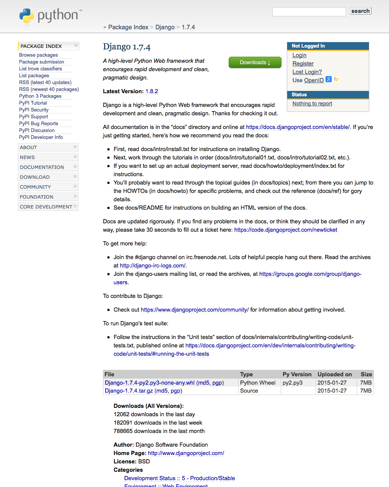
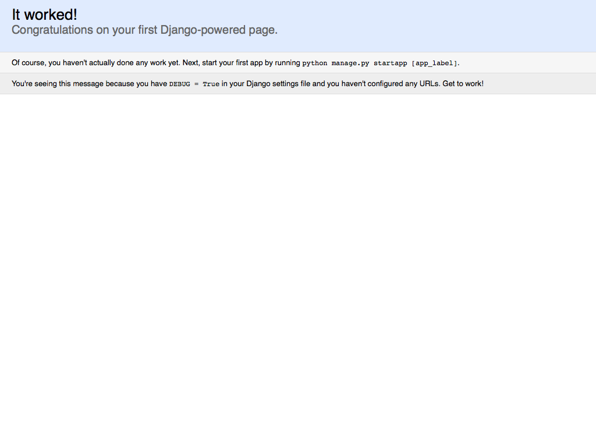

.. _`Django`:

Django
******

You have your text editor, compiler, Bash profile, package manager, programming language, and database. *Whew!* Depending on your computer's prior setup, you might have been able to skip to this step, but we're being thorough to lay the foundation for success. It's time to install Django!

Let's find a suitable place for your Django project code. I prefer to save my websites to the ``Sites`` folder. The ``Sites`` folder used to be in your OS X home folder, but Apple removed it several versions ago. Let's put it back and change into it now. If it already exists, this command won't overwrite it.

.. code-block:: bash

   $ mkdir -p ~/Sites/ && cd ~/Sites/

If you haven't already made and entered your virtual environment, do so now.

.. code-block:: bash

   $ mkvirtualenv hello
   New python executable in hello/bin/python2.7
   Also creating executable in hello/bin/python
   Installing setuptools, pip...done.
   (hello)$ 

If you have an existing environment and exited it, enter it with ``workon hello``.

Installing Django
=================

We're all ready to go! Let's install Django with pip!

.. code-block:: bash

   (hello)$ pip install django
   Downloading/unpacking django
     Downloading Django-1.7.4-py2.py3-none-any.whl (7.4MB): 7.4MB downloaded
   Installing collected packages: django
   Successfully installed django
   Cleaning up...

Without specifying a version of Django, that is ``pip install django==1.7.4``, the latest version was installed, at the time of this writing 1.7.4. You can read about Django 1.7.4 on `PyPi's package page <https://pypi.python.org/pypi/Django/1.7.4>`_.

If you're interested in the nitty gritty: pip installed the file ``Django-1.7.4-py2.py3-none-any.whl``, which indicates Django version 1.7.4 was installed (``Django-1.7.4``) and that it's compatible with Python versions 2 (``py2``) and 3 (``py3``). The ``.whl`` file extension indicates that the file is in the `wheel <http://wheel.readthedocs.org/en/latest/index.html>`_ format, which is a ZIP-format archive for Python packages and `improvement <http://wheel.readthedocs.org/en/latest/index.html#why-not-egg>`_ over Python's previous `egg <http://peak.telecommunity.com/DevCenter/PythonEggs>`_ format, which were similar ZIP-format archives created with `setuptools <http://pythonhosted.org/setuptools/>`_ and often used with Easy Install. ``none`` indicates purposeful omission of a hash string used in security to verify the package's validity. Django instead uses its own `MD5 <https://en.wikipedia.org/wiki/MD5>`_ hash string in the names of its files, which pip installs from a `simplified version <https://pypi.python.org/simple/django/>`_ of PyPi's download page. If you scan diligently, you can see ``Django-1.7.4-py2.py3-none-any.whl`` in the list!

Now that Django is installed, we use the ``django-admin`` utility to start a new project.

.. code-block:: bash

   (hello)$ django-admin startproject hello

But wait---how can Bash know where ``django-admin`` is and how to run this command?

When you activated your virtual environment, the file ``~/.virtualenvs/hello/bin/activate`` was automatically run, which in turn `ran <https://github.com/pypa/virtualenv/blob/develop/virtualenv_embedded/activate.sh#L46>`_ the commands ``PATH="$VIRTUAL_ENV/__BIN_NAME__:$PATH"`` and ``export PATH``. virtualenv was smart enough to prepend the ``bin`` directory of the virtual environment (``$VIRTUAL_ENV/bin``) to the ``PATH`` environment variable (``$PATH``). While your virtual environment is active, the *new* ``PATH`` might look more like:

.. code-block:: bash

   $ echo $PATH
   /Users/Rich/.virtualenvs/hello/bin:/usr/local/bin:/usr/bin:/bin:/usr/sbin:/sbin

What about ``django-admin``? When you ran ``pip install django``, pip was smart enough during installation to recognize `Django's own <https://github.com/django/django/blob/master/django/bin/django-admin.py>`_ ``django-admin`` script file as an executable file by virtue of `its placement <https://docs.python.org/2/distutils/setupscript.html#installing-scripts>`_ in `Django's setup.py <https://github.com/django/django/blob/master/setup.py#L46>`_, and then to copy it to your virtual environment's binary directory, ``~/.virtualenvs/hello/bin``. In other words, there were a lot of smart, hard-working developers to make sure everything lines up into one neat, little command!

.. note::

   For the sake of simplicity, I recommend creating one Django project for every one virtual environment, and that you use the same name for your Django project as your virtual environment.

After running ``django-admin startproject hello``, Django created a ``hello`` directory that looks like the tree structure below.

::

    hello
    ├── manage.py
    ├── hello
        ├── __init__.py
        ├── settings.py
        ├── urls.py
        ├── wsgi.py

You can see that within ``hello`` a ``manage.py`` file was created alongside another ``hello`` directory. Within the second ``hello`` directory, other files like ``__init__.py`` and ``settings.py`` exist.

Every Django project comes with a ``manage.py`` file, which is the `utility you will use <https://docs.djangoproject.com/en/1.7/ref/django-admin/>`_ to run commands. You could continue to use ``django-admin``, but it's a global utility that could be run against *several* Django projects within a single virtual environment, and would need further configuration to run commands specific to our *single* project. For that reason, I recommend using ``manage.py`` from now on. Thanks, ``django-admin``. It has been real.

.. note::

   Beginners are often confused by the way in which Django project code interacts with the activated virtual environment. *Your* Django project code, represented by ``~/Sites/hello/``, does *not* go into the directory of your virtual environment, ``~/.virtualenvs/hello/``. Your virtual environment merely isolates software packages you install, like Django, from other packages in their respective virtual environments. Your project directory contains code that *hooks into* Django, which pip installed to ``~/.virtualenvs/hello/lib/python2.7/site-packages/``.

To get all those awesome "`batteries included <https://docs.djangoproject.com/en/1.7/ref/contrib/>`_" that come with Django, you have to `create the database tables <https://docs.djangoproject.com/en/1.7/topics/migrations/>`_ for them. Change into your project directory and run the |migrate|_ command.

.. |migrate| replace:: ``migrate``
.. _migrate: https://docs.djangoproject.com/en/1.7/ref/django-admin/#django-admin-migrate

.. code-block:: bash

   (hello)$ cd ~/Sites/hello/
   (hello)$ python manage.py migrate
   Operations to perform:
     Apply all migrations: admin, contenttypes, auth, sessions
   Running migrations:
     Applying contenttypes.0001_initial... OK
     Applying auth.0001_initial... OK
     Applying admin.0001_initial... OK
     Applying sessions.0001_initial... OK

Django provides several of its own Django-specific Python packages---known as "Django apps"---for use right out of the box. These apps include the `content types <https://docs.djangoproject.com/en/1.7/ref/contrib/contenttypes/>`_ app, the `authentication and authorization <https://docs.djangoproject.com/en/1.7/topics/auth/>`_ app, the `admin <https://docs.djangoproject.com/en/1.7/ref/contrib/admin/>`_ app, and the `sessions <https://docs.djangoproject.com/en/1.7/topics/http/sessions/>`_ app. Django's own apps are decoupled from the framework, which means they can be removed, but it's a good idea to leave them installed because various third-party apps can depend on them. Django's default apps use the `publicly documented methods <https://docs.djangoproject.com/en/1.7/intro/reusable-apps/>`_ by which all apps are loaded, which means that the framework "`eats its own dog food <https://en.wikipedia.org/wiki/Eating_your_own_dog_food>`_"---a very good sign when software uses itself!

After migrating, run the local web server that comes with Django with |runserver|_. The local web server simulates a production web server, which makes it great for clicking around on your simulated website without deploying it live to the web.

.. |runserver| replace:: ``runserver``
.. _runserver: https://docs.djangoproject.com/en/1.7/ref/django-admin/#django-admin-runserver

.. code-block:: bash

   (hello)$ python manage.py runserver
   Performing system checks...

   System check identified no issues (0 silenced).
   February 09, 2015 - 21:50:56
   Django version 1.7.4, using settings 'hello.settings'
   Starting development server at http://127.0.0.1:8000/
   Quit the server with CONTROL-C.

.. warning::

   The ``runserver`` command is meant only for `testing your website on your personal computer <https://docs.djangoproject.com/en/1.7/ref/django-admin/#runserver-port-or-address-port>`_. It is **not** suitable for production use. From Django's documentation: "We’re in the business of making Web frameworks, not Web servers, so improving this server to be able to handle a production environment is outside the scope of Django."

The moment of truth
===================

Time for the moment of truth! Open a web browser and visit `http://127.0.0.1:8000 <http://127.0.0.1:8000>`_. At long last you should see the "It worked!" page. Great job! Feel free to celebrate in the way befitting to you: back pats, high fives, fist bumps, etc.

You can go back to Terminal and quit the local server by pressing ``CONTROL-C``. You can exit your virtual environment.

.. code-block:: bash

   ^C(hello)$ deactivate

Clean in house
==============

I recommed setting a default project directory for your virtual environment. The default project directory is the directory you automatically change to when you start working on your project, and affords you to not think about which directories to traverse to start working.

You can set your project directory with virtualenvwrapper's ``setvirtualenvproject`` command.

.. code-block:: bash

   $ setvirtualenvproject $WORKON_HOME/hello ~/Sites/hello
   Setting project for hello to /Users/rich/Sites/hello

To start working on your project again, just run the virtualenvwrapper ``workon`` command. Run the Bash ``pwd`` command to show that you are in fact in the project directory.

.. code-block:: bash

   $ workon hello
   (hello)$ pwd
   /Users/rich/Sites/hello

Additionally you can use the ``cdproject`` command to snap back to your project directory if you ever move away from it.

Now that your project is set up, you can deactivate your virtual environment.

.. code-block:: bash

   (hello)$ deactivate

Exit your Bash session cleanly.

.. code-block:: bash

   $ exit
   logout

   [Process completed]

.. note::

   If for whatever reason you'd like to remove your virtual environment and your Django project:

   .. code-block:: bash

      $ rmvirtualenv hello
      $ rm -rf ~/Sites/hello/

Congratulations on your first steps to becoming a Django web developer!

Please visit `FriendlyDjango.org <https://friendlydjango.org/>`_ for more tutorials, including `Friendly Photos <https://friendly-photos.readthedocs.org/en/latest/>`_, which is the next step in how to create a Django web application!
