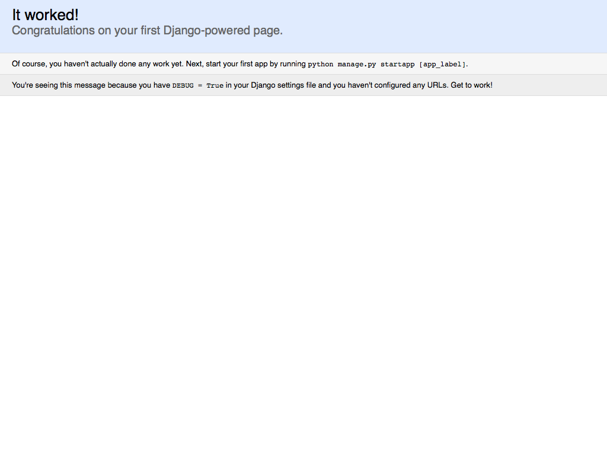

.. _`Django`:

Django
======

You have your text editor, compiler, Bash profile, package manager, programming language, and database. It's time to install Django!

Let's find a suitable place for your Django project code. I prefer to save my websites to the ``Sites`` folder. The ``Sites`` folder used to be in your OS X home folder, but Apple removed it several versions ago. Let's put it back and change into it now. If it already exists, this command won't overwrite it.

.. code-block:: bash

   $ mkdir -p ~/Sites/ && cd ~/Sites/

If you haven't already made and entered your virtual environment, make one now.

.. code-block:: bash

   $ mkvirtualenv myenv
   New python executable in myenv/bin/python2.7
   Also creating executable in myenv/bin/python
   Installing setuptools, pip...done.
   (myenv)$ 

If you have an existing environment and exited it, enter it with ``workon myenv``.

Installing Django
-----------------

We're all ready to go! Let's install Django with pip!

.. code-block:: bash

   (myenv)$ pip install django
   Downloading/unpacking django
     Downloading Django-1.7.4-py2.py3-none-any.whl (7.4MB): 7.4MB downloaded
   Installing collected packages: django
   Successfully installed django
   Cleaning up...

Now that Django is installed, we use the ``django-admin`` utility to start a new project.

.. code-block:: bash

   (myenv)$ django-admin startproject myproject

Django created a ``myproject`` directory that looks like the tree structure below.

::

    myproject
    ├── manage.py
    ├── myproject
        ├── __init__.py
        ├── settings.py
        ├── urls.py
        ├── wsgi.py

Every Django project comes with a ``manage.py`` file, which is the `utility you will use <https://docs.djangoproject.com/en/1.7/ref/django-admin/>`_ to run commands. You could continue to use ``django-admin``, but it is a global utility, and would need further configuration to run commands specific to our project. For that reason, I recommend using ``manage.py``.

Change into your project directory.

.. code-block:: bash

   (myenv)$ cd myproject

To get all those awesome "`batteries included <https://docs.djangoproject.com/en/1.7/ref/contrib/>`_" that come with Django, you have to `create the database tables <https://docs.djangoproject.com/en/1.7/topics/migrations/>`_ for them with |migrate|_.

.. |migrate| replace:: ``migrate``
.. _migrate: https://docs.djangoproject.com/en/1.7/ref/django-admin/#django-admin-migrate

.. code-block:: bash

   $ python manage.py migrate
   Operations to perform:
     Apply all migrations: admin, contenttypes, auth, sessions
   Running migrations:
     Applying contenttypes.0001_initial... OK
     Applying auth.0001_initial... OK
     Applying admin.0001_initial... OK
     Applying sessions.0001_initial... OK

After you create the database tables, run the local web server that comes with Django with |runserver|_. The local web server simulates a production web server, which makes it great for clicking around on your simulated website without deploying it live to the web.

.. |runserver| replace:: ``runserver``
.. _runserver: https://docs.djangoproject.com/en/1.7/ref/django-admin/#django-admin-runserver

.. code-block:: bash

   $ python manage.py runserver
   Performing system checks...

   System check identified no issues (0 silenced).
   February 09, 2015 - 21:50:56
   Django version 1.7.4, using settings 'myproject.settings'
   Starting development server at http://127.0.0.1:8000/
   Quit the server with CONTROL-C.

The moment of truth
-------------------

Time for the moment of truth! Open a web browser and go to `http://127.0.0.1:8000 <http://127.0.0.1:8000>`_. At long last you should see the "It worked!" page. Great job! Feel free to celebrate in the way befitting to you: back pats, high fives, fist bumps, etc.

You can go back to Terminal and quit the local server by pressing ``CONTROL-C``. You can exit your virtual environment.

.. code-block:: bash

   ^C(myenv)$ deactivate

Clean in house
--------------

I highly recommed setting a default project directory for your virtual environment. The default project directory is the directory you automatically change to when you start working on your project. You can start working immediately without thinking about which directories to traverse.

You can set your project directory with virtualenvwrapper's ``setvirtualenvproject`` command.

.. code-block:: bash

   $ setvirtualenvproject $WORKON_HOME/myenv ~/Sites/myproject
   Setting project for myenv to /Users/rich/Sites/myproject

To start working on your project again, just run the virtualenvwrapper ``workon`` command. I'll then run the Bash ``pwd`` command to show that I am in fact in the project directory.

.. code-block:: bash

   $ workon myenv
   (myenv)$ pwd
   /Users/rich/Sites/myproject

Additionally you can use the ``cdproject`` command to snap back to your project directory if you ever move away from it.

Now that your project is set up, you can deactivate your virtual environment and exit your Bash Session cleanly.

.. code-block:: bash

   (myenv)$ deactivate
   $ exit
   logout

   [Process completed]

Congratulations on your first steps to becoming a Django web developer!
