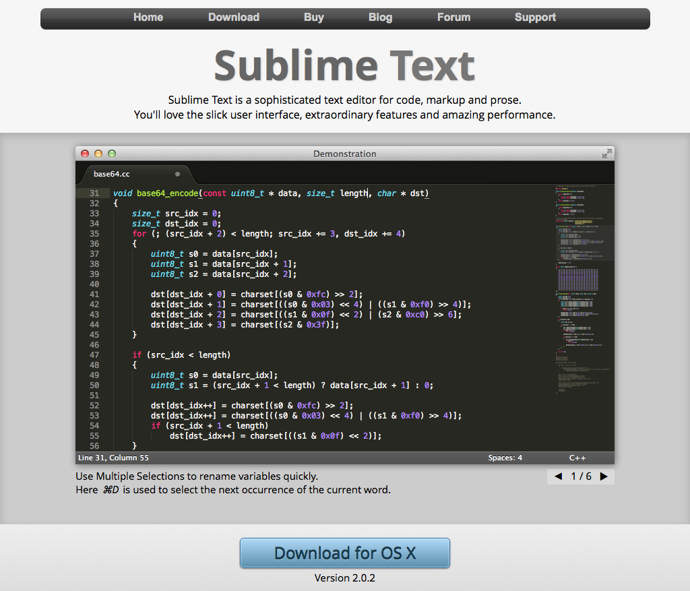
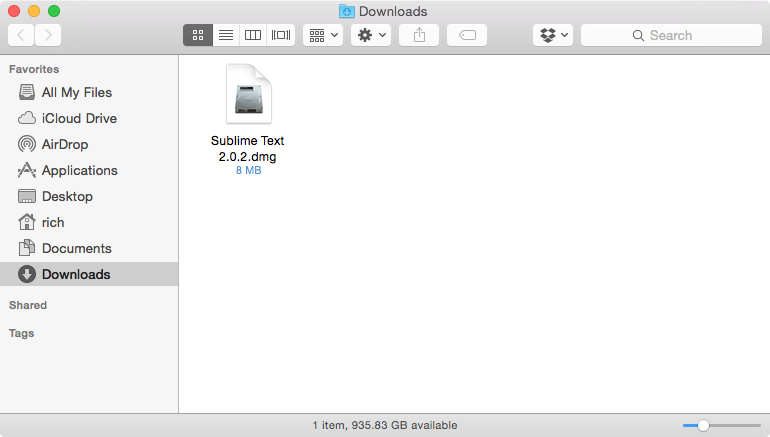
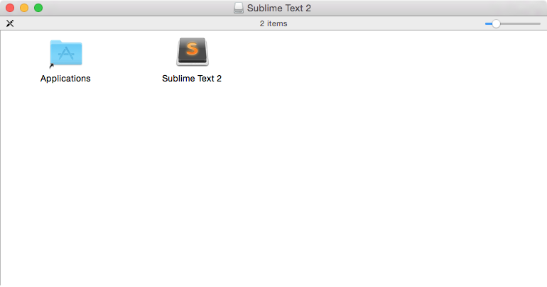
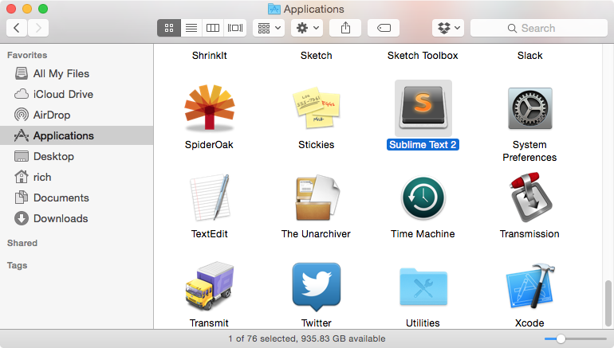
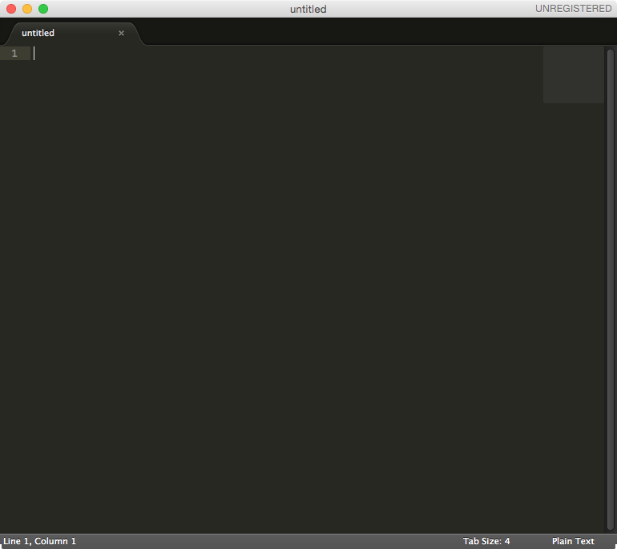
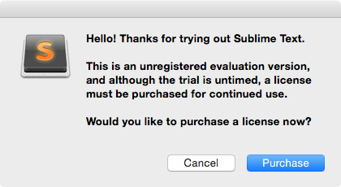

Text editor
===========

The first step in any web developer's journey is to get a good text editor.

What is a text editor?
----------------------

A **text editor** is an application that allows you to write code, which is simply text without formatting options like bold or alignment. `Microsoft Word <https://en.wikipedia.org/wiki/Microsoft_Word>`_ and `TextEdit <https://en.wikipedia.org/wiki/TextEdit>`_ are word processors, which are similar to text editors, but often come with features that make those applications inappropriate for writing code.

Like all good things in life, people have a wide range of opinions on which text editor is "the best." And like all good things in life, finding "the best" text editor is not important; what's important is finding the best text editor *for you*.

Sublime Text is your new friend
-------------------------------

As a beginning developer, you should use a text editor that is fairly easy to understand and use, is in active development, offers plugins and add-ons after you become more advanced, has a strong community supporting it, and doesn't cost much. For those reasons, I recommend **Sublime Text**.

Sublime Text is a popular, open-source text editor that beginners and professionals alike use. Hundreds of `add-on packages <https://packagecontrol.io/>`_, `themes <https://packagecontrol.io/browse/labels/theme>`_, and `tutorials <http://code.tutsplus.com/categories/sublime-text>`_ exist for it. It's also free with minimal intrusion. `Download Sublime Text <http://www.sublimetext.com/>`_ from its website by clicking the "Download for OS X" button.

Installing Sublime Text
-----------------------

Find the DMG you downloaded, which is probably in your ``Downloads`` folder and was called ``Sublime Text 2.0.2.dmg`` at the time of this writing. 

Open the DMG by double clicking on it. The DMG will mount the Finder and a new window will appear. Drag the ``Sublime Text 2`` icon into the ``Applications`` shortcut folder.

You can now close the windows, eject the mount by dragging it from the Desktop to the Trash, and trash the DMG.

Open a new Finder window and navigate to the ``Applications`` folder. Find the Sublime Text app icon and open it.

Congratulations! You are now using a world-class text editor.

Although Sublime Text is free, it pops up an occasional window reminding you to purchase it if you found it useful. You can click ``Cancel`` or press ``Esc`` when it appears, but feel free to eventually support the developers who work hard to make software free to use.

I recommend dragging the Sublime Text icon from the ``Applications`` folder `into your Dock <http://support.apple.com/kb/PH18815>`_ for easy access in the future.

It's always good to remember that what's in vogue today might not be in vogue tomorrow. A few years ago, `TextMate <http://macromates.com/>`_ was the text editor of choice until it languished in development. `Coda <https://panic.com/coda/>`_ has a small but dedicated audience. Seasoned veterans use `Vim <https://en.wikipedia.org/wiki/Vim_(text_editor)>`_ and `Emacs <http://en.wikipedia.org/wiki/Emacs>`_, and newcomers include `Brackets <http://brackets.io/>`_ and `Atom <https://atom.io/>`_. You might even get a sheepish confession from someone using `nano <https://en.wikipedia.org/wiki/GNU_nano>`_.

Developers like to brag about their text editor of choice, but always remember: What you make in your editor is far more important than which editor you're using.

Now that we have a text editor, let's start using it!
